<picture>
  <source media="(prefers-color-scheme: dark)" srcset="./assets/hero-dark.webp">
  <source media="(prefers-color-scheme: light)" srcset="./assets/hero-light.webp">
  
</picture>

<h1 align="center">Hi, I'm Jakeuj 👋</h1>

<h3 align="center">.NET &amp; Cloud Engineer building AI-powered tools from Taiwan.</h3>

  I turn infrastructure, automation, and real-world troubleshooting into
  open-source tools and practical technical notes.

  
  
  
  
  

## What I build

| Area | What I care about |
| --- | --- |
| **.NET & application engineering** | C#, ASP.NET Core, ABP, integrations, modernization, and reliable delivery |
| **Cloud & DevOps** | Azure, Google Cloud, Docker, CI/CD, observability, and production troubleshooting |
| **AI tooling** | Codex and Claude Code plugins, agent workflows, automation, and practical local AI |
| **Technical knowledge** | Reproducible notes that turn solved incidents into reusable public documentation |

## Core stack

  
  
  
  
  
  
  
  
  
  
  

## Selected work

| Project | Focus | Stack |
| --- | --- | --- |
| [**Jakeuj's Notes**](https://github.com/jakeuj/writerside) | A Traditional Chinese knowledge base for .NET, cloud, DevOps, AI tooling, macOS, and field-tested troubleshooting | Writerside · Markdown · GitHub Pages |
| [**CodexPlugins**](https://github.com/jakeuj/CodexPlugins) | Curated Codex and Claude Code plugins for reusable agent-assisted development workflows | Skills · MCP · Shell |
| [**Pixer .NET**](https://github.com/jakeuj/pixerDotnet) | A .NET 9 client for image conversion, TCP device communication, and firmware workflows | C# · .NET 9 · TCP |

## Engineering snapshot

  
  

## Find me around the web

- 📚 **Knowledge base:** [Jakeuj's Notes](https://jakeuj.com/default.html)
- 💼 **Professional:** [LinkedIn](https://www.linkedin.com/in/jakeuj/) · [Stack Overflow](https://stackoverflow.com/users/4104545/jakeuj) · [ORCID](https://orcid.org/0009-0007-4608-9900)
- 💬 **Community:** [Discord](https://discord.gg/BDaMRGp) · [X](https://twitter.com/jakeuj) · [Reddit](https://www.reddit.com/user/jakeuj/)
- 🎬 **Video:** [YouTube](https://www.youtube.com/@Jakeuj) · [Bilibili](https://space.bilibili.com/2508649/)

<strong>All social, publishing, and support links</strong>

- Publishing: [點部落](https://www.dotblogs.com.tw/jakeuj) · [RSS](https://www.dotblogs.com.tw/jakeuj/Rss)
- Developer profiles: [GitHub](https://github.com/jakeuj) · [Stack Overflow](https://stackoverflow.com/users/4104545/jakeuj) · [ORCID](https://orcid.org/0009-0007-4608-9900)
- Social: [Facebook](https://www.facebook.com/jakeuj/) · [X](https://twitter.com/jakeuj) · [Instagram](https://www.instagram.com/jakeuj00/) · [Reddit](https://www.reddit.com/user/jakeuj/)
- Community: [Discord](https://discord.gg/BDaMRGp)
- Video: [YouTube](https://www.youtube.com/@Jakeuj) · [Bilibili](https://space.bilibili.com/2508649/)
- Contact and support: [Email](mailto:jakeuj@hotmail.com) · [PayPal](https://www.paypal.com/ncp/payment/PLYGLLUS2Z8VS)

---

  <a href="https://jakeuj.com/default.html"><strong>Read my Traditional Chinese technical notes →</strong></a>

<!-- Profile README verified on 2026-07-28. -->
